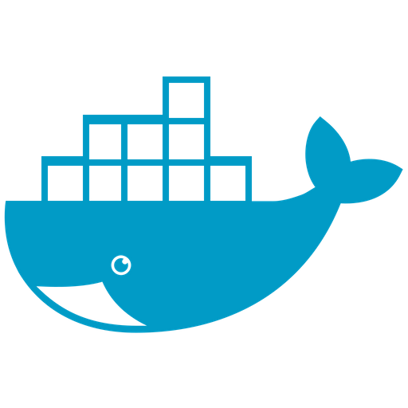

<h1 align="center">Welcome to my profile!</h1>

I'm Vishal Nirmal, Fullstack developer from India.

- 🔭 I’m currently working at **Infynno Solutions in Ahmedabad**
- 🌱 I’m currently learning **AWS, Docker and Kubernetes**
- 💬 Ask me about **React, NodeJS, NestJS**
- 📫 How to reach me: [vishal.infynno@gmail.com](mailto:vishal.infynno@gmail.com) via email

---
<h2 align="left" id="vishal-infynno-tech">Favorite Tech & Stats</h2>

> Tools, languages, and other things that I like to work with.

<table>
  <tr>
    <td align="center" width="96">
      
       Node.js
    </td>
    <td align="center" width="96">
      
       Express
    </td>
    <td align="center" width="96">
      
       Reactjs
    </td>
    <td align="center" width="96">
      
       TypeScript
    </td>
    <td align="center" width="96">
      
       MySql
    </td>
    <td align="center" width="96">
      
       Postgresql
    </td>
    <td align="center" width="96">
      
       MongoDB
    </td>
    <td align="center" width="96">
      
       AWS
    </td>
   
  </tr>
  <tr>
   <td align="center" width="96">
      
       Docker
    </td>
    <td align="center" width="96">
      
       GitHub
    </td>
    <td align="center" width="96">
      
       Linux
    </td>
    <td align="center" width="96">
      
       Discord
    </td>
    <td align="center" width="96">
      
       Slack
    </td>
  </tr>
</table>

  
  
  
   
  

